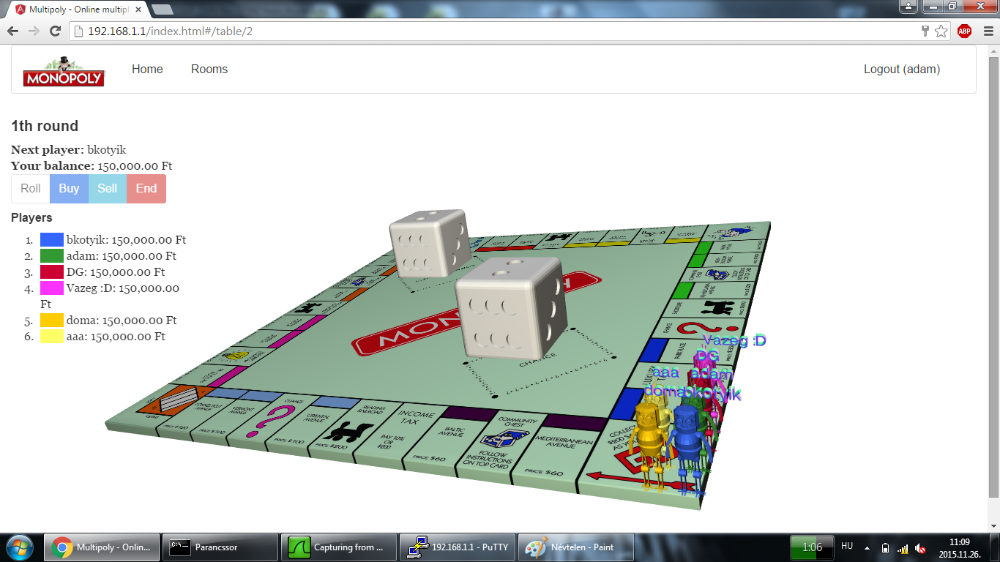
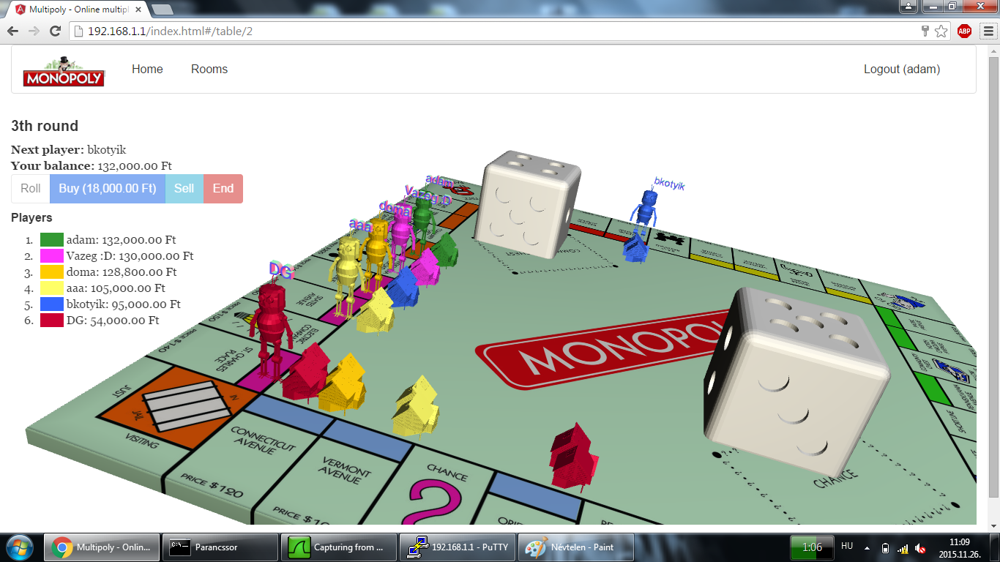

# monopoly
Browser based online multiplayer monopoly game written in C++ (backend) and Typescript (frontend).

## Compile guide
### Frontend
1. Step into the frontend folder.
2. Run **npm  install** to install the dependencies.
3. Install grunt with the **npm install –g grunt-cli** command.
4. Build the frontend with the **grunt build** command.
### Backend - Windows
1. Install dependencies: **vcpkg install libevent:x64-windows-static curl:x64-windows**
 > Note: libcurl can be ommitted when not using emails.
2. Update .h/.lib/.dll files at **x64-win-dep** with the previously installed ones (should be at vcpkg root dir/installed/x64-windows-static or x64-windows).
3. Open the Visual Studio solution at **backend/Monopoly.sln**
4. Set the solution configuration to **Release** and the solution platform to **x64**.
5. Under **Build** menu, click **Build Solution**.
### Backend - Linux
1. Step into the backend folder.
2. Install cmake: **apt install cmake**
3. Install libevent: **apt install libevent-dev**
4. Add FindLibEvent.cmake if missing (also check cmake version and update "cmake-2.8" dir accordingly): **cp build_scripts/FindLibEvent.cmake /usr/share/cmake-2.8/Modules/FindLibEvent.cmake**
5. Copy the CMakeLists file to the project root directory: **cp build_scripts/LinuxCMakeLists.txt CMakeLists.txt**
6. Generate makefile: **cmake . -DCMAKE_CXX_COMPILER=/usr/bin/g++**
7. Build: **make**
### Backend - Router (OpenWRT Barrier Breaker 14.07, Asus RT-N14U, ramips/mt7620n)
1. Install cmake: **apt install cmake**
2. Clone repository: **git clone https://github.com/szedenik-adam/monopoly**
3. Step into the repo's backend directory **cd monopoly/backend**
4. Download OpenWRT SDK: **wget https://downloads.openwrt.org/barrier_breaker/14.07/ramips/mt7620n/OpenWrt-SDK-ramips-for-linux-x86_64-gcc-4.8-linaro_uClibc-0.9.33.2.tar.bz2**
5. Extract the archive: **tar -xf OpenWrt-SDK-ramips-for-linux-x86_64-gcc-4.8-linaro_uClibc-0.9.33.2.tar.bz2**
6. Copy the CMakeLists file to the project root directory: **cp build_scripts/RouterStaticCMakeLists.txt CMakeLists.txt**
7. Set staging dir for the compiler: **export STAGING_DIR=OpenWrt-SDK-ramips-for-linux-x86_64-gcc-4.8-linaro_uClibc-0.9.33.2/staging_dir**
9. Generate makefile: **cmake .**
10. Build: **make**

## Screenshots

## Authors
Márton Bálint - frontend

Ádám Szedenik - backend